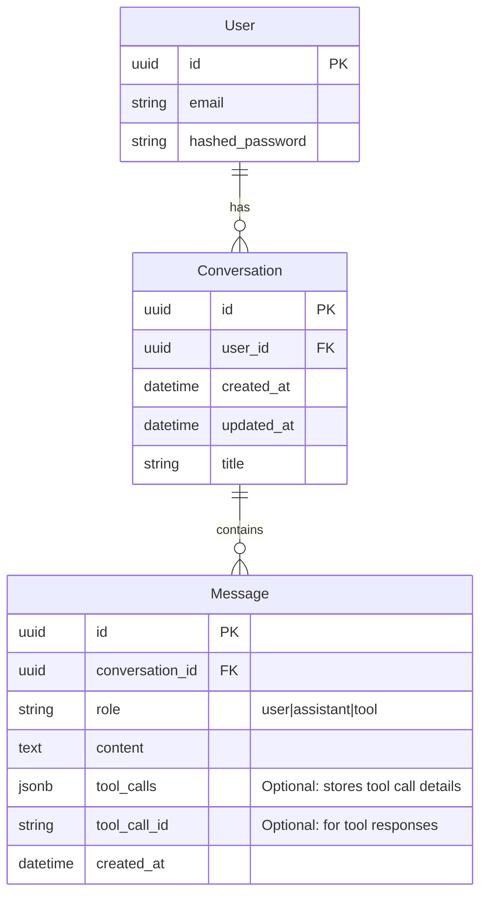

# Data Model: AI Chatbot (Phase III)

## ER Diagram (Mermaid)

## Schema Definitions (SQLModel)

### Conversation
| Field | Type | Required | Description |
|-------|------|----------|-------------|
| id | UUID | Yes | Primary Key |
| user_id | UUID | Yes | Foreign Key to User |
| title | String | No | Auto-generated title |
| created_at | DateTime | Yes | UTC timestamp |
| updated_at | DateTime | Yes | Last activity timestamp |

### Message
| Field | Type | Required | Description |
|-------|------|----------|-------------|
| id | UUID | Yes | Primary Key |
| conversation_id | UUID | Yes | Foreign Key to Conversation |
| role | String | Yes | enum: user, assistant, system, tool |
| content | Text | Yes | The message content |
| tool_calls | JSON | No | Metadata for tool calls (if role=assistant) |
| tool_call_id | String | No | ID of the call (if role=tool) |
| created_at | DateTime | Yes | UTC timestamp |
