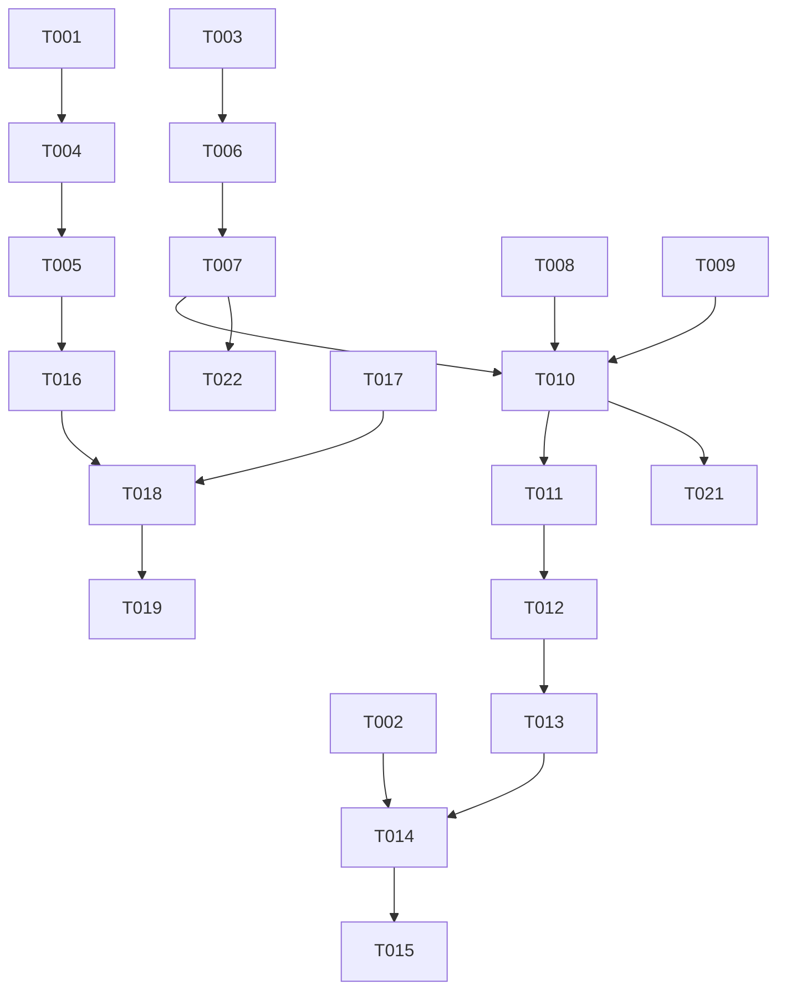

# Tasks: AI Chatbot & MCP Integration (Phase III)

**Branch**: `001-ai-chatbot-mcp`
**Spec**: [spec.md](./spec.md)
**Plan**: [plan.md](./plan.md)

## Phase 1: Setup

**Phase Goal**: Initialize project dependencies and directory structure.

- [x] T001 Install Backend Dependencies (OpenAI Agents SDK, MCP) in `backend/requirements.txt`
- [x] T002 Install Frontend Dependencies (OpenAI ChatKit) in `frontend/package.json`
- [x] T003 Create directory structure for MCP and Agent in `backend/src/`

## Phase 2: Foundational (Blocking)

**Phase Goal**: Establish data models and core infrastructure.

- [x] T004 Create Conversation and Message SQLModel models in `backend/src/models/conversation.py`
- [x] T005 Create database migration for new tables in `backend/alembic/versions/`
- [x] T006 Scaffold Basic MCP Server structure in `backend/src/mcp/server.py`

## Phase 3: User Story 1 - Basic Task Management via Chat

**Priorities**: P1
**Goal**: Enable users to manage tasks (add, list, complete) via natural language.
**Independent Test**: User can add, list, and complete tasks via chat without using the traditional UI.

### MCP Tools
- [x] T007 [US1] Implement `add_task` MCP tool in `backend/src/mcp/tools.py`
- [x] T008 [US1] Implement `list_tasks` MCP tool in `backend/src/mcp/tools.py`
- [x] T009 [US1] Implement `complete_task` MCP tool in `backend/src/mcp/tools.py`

### Agent & API
- [x] T010 [US1] Implement Agent Logic (Tool registration & execution) in `backend/src/agent/service.py`
- [x] T011 [US1] Create `/api/chat` endpoint with basic message handling in `backend/src/api/chat.py`
- [x] T012 [US1] Register chat router in `backend/src/main.py`

### Frontend Integration
- [x] T013 [US1] Create Chat Service client in `frontend/src/services/chat.ts`
- [x] T014 [US1] Implement ChatInterface component with ChatKit in `frontend/src/components/chat/ChatInterface.tsx`
- [x] T015 [US1] Create Chat Page in `frontend/src/pages/chat.tsx`

## Phase 4: User Story 2 - Conversation Persistence

**Priorities**: P2
**Goal**: Ensure conversations are saved and can be resumed across sessions.
**Independent Test**: Restart server and verify conversation context is preserved.

- [x] T016 [US2] Implement functionality to load Conversation/Messages from DB in `backend/src/agent/service.py`
- [x] T017 [US2] Implement functionality to save new Messages to DB in `backend/src/agent/service.py`
- [x] T018 [US2] Update `/api/chat` to handle `conversation_id` for resumption in `backend/src/api/chat.py`
- [x] T019 [US2] Update Frontend to store/retrieve conversation ID in `frontend/src/components/chat/ChatInterface.tsx`

## Phase 5: User Story 3 - Error Handling and Clarification

**Priorities**: P3
**Goal**: Handle ambiguous requests and errors gracefully.
**Independent Test**: Provide ambiguous input and verify agent asks for clarification.

- [x] T020 [US3] Implement `delete_task` and `update_task` MCP tools in `backend/src/mcp/tools.py`
- [x] T021 [US3] Refine System Prompt for clarification behaviors in `backend/src/agent/prompts.py`
- [x] T022 [US3] Add error handling decorators/logic to all MCP tools in `backend/src/mcp/tools.py`
- [x] T023 [US3] Implement error feedback display in `frontend/src/components/chat/ChatInterface.tsx`

## Phase 6: Polish & Cross-Cutting

**Goal**: Final cleanup and testing.

- [x] T024 Verify full end-to-end flow with server restart test
- [x] T025 Cleanup temporary code and add final comments

## Dependencies

## Implementation Strategy

1. **MVP (US1)**: Focus on getting a single turn working. User says "Add task", Agent calls Tool, Tool updates DB, Agent responds.
2. **Persistence (US2)**: Once the loop works, ensure we are loading state from DB at start of request and saving at end. Use strict statelessness (no global variable for conversation history).
3. **Robustness (US3)**: Add the remaining tools and refine the prompts.
